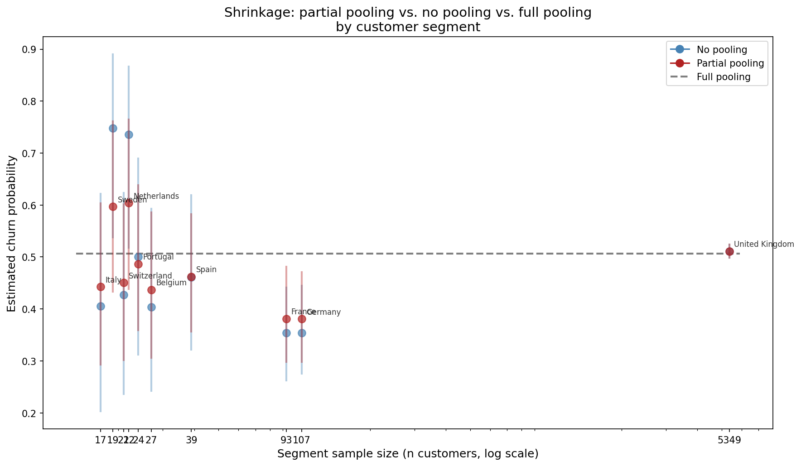
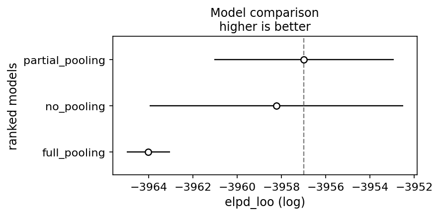

# Bayesian Customer Segmentation

Partial pooling over heterogeneous customer segments using a Bayesian hierarchical model, with a three-way comparison against no-pooling and full-pooling baselines. The data are from the [UCI Online Retail II dataset](https://archive.ics.uci.edu/dataset/502/online+retail+ii). The methodology generalizes directly to any setting where a binary outcome (churn, default, conversion, programme uptake) is observed across segments with unequal data density — retail banking portfolios, B2B distributor networks, regional economic indicators, or multi-site programme evaluations.



Shrinkage plot: **Small segments are pulled toward the global mean in proportion to their uncertainty (Sweden, Italy, Netherlands). Large segments are left where their data puts them (United Kingdom).** The two limiting cases, fitting independent models per segment (no pooling) and fitting a single global model (full pooling), are included as baselines.

---

## The problem

A common pattern in customer analytics is to partition the data into segments, compute per-segment statistics (mean churn rate, average revenue, conversion rate), and act on those statistics as if they were equally reliable across segments. The partition is typically done by clustering or by natural groupings such as country, product line, or customer tier. This is a reasonable starting point, but it treats a 75% churn rate estimated from 17 customers with the same confidence as a 51% rate estimated from 5,349. The uncertainty in thin segments is present but never surfaces in the output. Downstream decisions (acquisition budget allocation, retention spend, limit-setting) carry unacknowledged risk concentrated exactly where the data is least informative.

One response is to add confidence intervals to per-segment estimates, which makes the uncertainty visible. However, what this does not do is use the other segments to resolve it. A small segment with an implausibly extreme value (e.g., 75% churn in a market where every comparable segment sits between 35% and 55%) receives no regularization from that context. The interval is wide and the point estimate unchanged. Cross-segment information is available but unused.

**Partial pooling addresses this directly. Segment-level parameters are treated as draws from a shared population distribution whose hyperparameters are estimated from the data jointly. Small segments are shrunk toward the global mean in proportion to their uncertainty. Large segments are shrunk very little.** A segment with 17 observations and an extreme estimate is pulled toward what the other segments suggest is plausible, with the strength of that pull estimated from the data rather than by some tuning choice. The between-segment standard deviation $\tau$ is the key quantity here: it is estimated from the full dataset and governs how much pooling occurs. When segments are genuinely homogeneous, $\tau$ is small and pooling is strong. When they are genuinely heterogeneous, $\tau$ is large and each segment is left closer to its own data. **The model selects the appropriate regime rather than requiring the analyst to assert it in advance. The result is that uncertainty is not suppressed but resolved: small segments get estimates that are honest about what the data can and cannot support, and the model allocates its confidence accordingly.**

---

## Model

All three models use a logistic likelihood. Segment membership enters as an intercept term indexed by segment $j[i]$ for observation $i$, with binary outcome $Y_i \in \{0, 1\}$ (churned / retained).

**No pooling**

$$\text{logit}(p_i) = \alpha_{j[i]}, \qquad \alpha_j \sim \mathcal{N}(0, 10)$$

Each segment gets an independent weakly informative prior. No information crosses segment boundaries.

**Full pooling**

$$\text{logit}(p_i) = \alpha, \qquad \alpha \sim \mathcal{N}(0, 10)$$

A single global intercept. Segment identity is discarded.

**Partial pooling**

$$\text{logit}(p_i) = \alpha_{j[i]}, \qquad \alpha_j \sim \mathcal{N}(\mu, \tau)$$
$$\mu \sim \mathcal{N}(0, 1), \qquad \tau \sim \text{HalfNormal}(1)$$

where:
- $\mu$ is the population mean churn log-odds, estimated from all segments jointly
- $\tau$ is the between-segment standard deviation on the log-odds scale, the key quantity governing how much pooling occurs
- $\alpha_j$ are segment-level intercepts, each informed by both the segment's own data and the population distribution

The model is implemented in the **non-centred parameterization**: rather than sampling $\alpha_j$ directly from $\mathcal{N}(\mu, \tau)$, we sample $\delta_j \sim \mathcal{N}(0, 1)$ and set $\alpha_j = \mu + \tau \cdot \delta_j$. This decouples the scale hyperparameter $\tau$ from the segment offsets in the posterior geometry, which is essential for sampling efficiency when $\tau$ is small.

---

## Key result

The posterior median for $\tau$ is **0.45** (94% HDI: [0.13, 0.86]). On the log-odds scale, one posterior standard deviation of between-segment variation corresponds to roughly 10–12 percentage points of churn probability near the centre of the logistic. This is meaningful heterogeneity, but not so large that pooling contributes nothing. Exactly the regime where partial pooling plays to its strengths.

The shrinkage plot above shows the effect concretely. On the x-axis is segment sample size (log scale); on the y-axis is estimated churn probability. Blue points are no-pooling estimates, red points are partial-pooling estimates, and the dashed grey line is the full-pooling global mean (approximately 51%).

Three patterns stand out. First, the no-pooling confidence intervals for small segments (n = 17–27) are so wide as to be nearly uninformative. Sweden and the Netherlands span 60+ percentage points. **The partial-pooling intervals are substantially tighter for the same segments because they borrow strength from the population distribution.** Second, the partial-pooling point estimates for small segments are pulled toward the global mean relative to the no-pooling estimates, with the pull proportional to uncertainty: Belgium (n = 27) moves less than Italy (n = 17). Third, the United Kingdom (n = 5,349) is barely affected: its estimate is well-identified by data alone, so the hierarchical prior contributes almost nothing, as it should.

**France and Germany (n = 93 and 107) are the clearest demonstration of the method's practical value.** Both show churn rates around 35–38%, notably below the global mean. Under no pooling, these estimates come with wide intervals that overlap substantially with the global mean. **Under partial pooling, the estimates are tightened and the departure from the global mean is more confidently resolved.** The data is sufficient to support a genuine country effect, and the model reflects that without either discarding or overfitting it.

---

## Model comparison

Leave-one-out cross-validation (LOO-CV) confirms the ranking suggested by the shrinkage plot. **Partial pooling achieves the highest expected log pointwise predictive density ($\widehat{\text{elpd}}_{\text{LOO}} \approx -3957$)**, followed by no pooling ($\approx -3959$), with full pooling substantially worse ($\approx -3964$).



Leave-one-out cross-validation plot: **Partial pooling achieves the highest expected log pointwise predictive density**. No pooling is closer than full pooling because the UK dominates this dataset in observations.

The gap between full pooling and the other two models is large and unambiguous; the intervals do not overlap. Full pooling discards real between-country variation, and the predictive penalty is detectable even though the UK (n = 5,349) contributes the majority of observations and is barely affected by pooling. The partial vs. no-pooling gap is smaller, with overlapping intervals. This is expected: LOO weights all observations equally, so the gains from regularising small segments (Sweden, Italy, Netherlands) are diluted by the UK's dominance. In a more balanced dataset the advantage of partial pooling would be more pronounced.

**In practice, this means that if you were to deploy a churn model and score a new customer from Belgium or Italy, partial pooling would give you a better-calibrated probability than either alternative — not because the model is more complex, but because it makes smarter use of the data it already has.**

---

## Sampler diagnostics

The partial pooling model requires care. The default NUTS settings (target acceptance rate 0.80) produced 60 divergences after tuning, concentrated at high values of $\tau$ rather than near $\tau \approx 0$. This rules out the classic funnel geometry that arises from centred parameterizations of hierarchical models; the non-centred form was already in use. The pattern instead indicates step-size sensitivity at the upper boundary of the posterior's typical set, where eleven heterogeneous segments create sharper curvature than the default step size can navigate.

Two remedies were tested: widening the prior on $\tau$ from HalfNormal(1) to HalfNormal(2), and increasing `target_accept` to 0.95. The wider prior reduced divergences to 23 but did not eliminate them, confirming that the prior specification was not the bottleneck. Increasing `target_accept` to 0.95 with 1,500 tuning steps reduced divergences to 1, with the remaining divergence scattered in the bulk of the posterior rather than concentrated at any boundary. The summary statistics for the final model confirm convergence: $\hat{R} < 1.01$ and ESS$_\text{bulk} > 400$ for all parameters.

The canonical model therefore uses HalfNormal(1) with `target_accept=0.95`. The full diagnostic sequence (pair plots, parallel plots, energy diagnostics, and the prior-widening experiment) is documented in `notebooks/03_models.ipynb`.

---

## Repo structure

```
bayesian-segmentation/
├── README.md
├── pyproject.toml
├── .gitignore
├── IMPLEMENTATION_LOG.md
├── data/
│   └── .gitkeep          # data not committed; download via script
├── figures/
│   └── shrinkage_plot.png
├── notebooks/
│   ├── 01_eda_and_checks.ipynb
│   ├── 02_feature_engineering.ipynb
│   ├── 03_models.ipynb   # models, divergence investigation, diagnostics
│   └── 04_results.ipynb  # shrinkage plot, LOO-CV comparison
├── src/
│   └── bcs/
│       ├── data.py        # load, clean, filter
│       ├── features.py    # panel construction, churn flag, segment encoding
│       └── models.py      # no-pool, full-pool, partial-pool in PyMC
├── tests/
│   ├── test_data.py
│   └── test_features.py
└── scripts/
    └── download_data.py
```

---

## Reproduce

**Requirements:** Python 3.11, [uv](https://github.com/astral-sh/uv), WSL2 or Linux (PyMC's multiprocessing is unreliable on Windows without WSL2).

```bash
git clone https://github.com/<username>/bayesian-segmentation.git
cd bayesian-segmentation
uv sync
uv run python scripts/download_data.py
uv run jupyter notebook
```

On first import, PyMC will compile its C extensions via pytensor. This takes 2–5 minutes and is normal. If the compilation fails with a compiler error, install build tools first:

```bash
sudo apt-get install gcc g++ build-essential
```

Then run the notebooks in order: `01` through `04`. Each notebook loads the outputs of the previous one from `data/`. Fitted traces are saved as NetCDF files via ArviZ and reloaded in `04_results` for plotting, so the full model run (approximately 15–20 minutes on a modern CPU) only needs to happen once.

**Tests:**

```bash
uv run pytest tests/ -v
```

---

## Dependencies

Core: `pymc >= 5.10`, `arviz >= 0.18`, `pandas >= 2.1`, `numpy >= 1.26`, `matplotlib >= 3.8`, `scikit-learn >= 1.4`. Full dependency specification in `pyproject.toml`.

---

## Further reading

The diagnostic framework used here — divergence geometry, $\hat{R}$, ESS, energy plots — is developed in detail in Betancourt (2017), [*A Conceptual Introduction to Hamiltonian Monte Carlo*](https://arxiv.org/abs/1701.02434). The hierarchical modelling foundations are covered in Gelman et al., *Bayesian Data Analysis* (3rd ed.), chapters 5 and 11–12.
